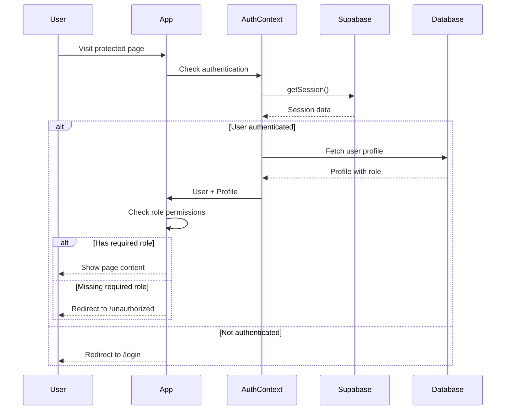

# Architecture Overview

## Role-Based Access Control (RBAC) Architecture

This document explains how the access control system is implemented across the stack.

## Security Layers

The application implements defense in depth with multiple security layers:

```
┌─────────────────────────────────────────────────────────────┐
│                    1. UI Layer (UX)                          │
│  Components: RoleGuard, conditional rendering                │
│  Purpose: User experience, hide unauthorized UI              │
└─────────────────────────────────────────────────────────────┘
                            ↓
┌─────────────────────────────────────────────────────────────┐
│              2. Client Route Protection                       │
│  Components: ProtectedRoute, useRequireAuth                   │
│  Purpose: Client-side navigation guards                       │
└─────────────────────────────────────────────────────────────┘
                            ↓
┌─────────────────────────────────────────────────────────────┐
│              3. Middleware Layer (Optional)                   │
│  File: middleware.ts                                          │
│  Purpose: Server-side route protection                        │
└─────────────────────────────────────────────────────────────┘
                            ↓
┌─────────────────────────────────────────────────────────────┐
│              4. Database RLS Policies (CRITICAL)              │
│  Location: Supabase RLS policies                              │
│  Purpose: Enforce data access at database level               │
└─────────────────────────────────────────────────────────────┘
```

## Authentication Flow



## Role Hierarchy

```
Owner (Highest Privilege)
  ├── Full admin access
  ├── User management
  ├── All Analyst permissions
  └── All Client permissions

Analyst (Medium Privilege)
  ├── View all clients & assessments
  ├── Create/Update resources
  └── Limited to assigned assessments for updates

Client (Lowest Privilege)
  └── View only assigned assessments
```

## Component Architecture

### AuthProvider Context

Central authentication state management:

```typescript
<AuthProvider>
  ├── Manages: user, profile, loading states
  ├── Provides: signIn, signUp, signOut, hasRole
  └── Children: Entire application
```

### ProtectedRoute Component

Page-level protection:

```typescript
<ProtectedRoute requiredRoles={['owner']}>
  <AdminPage />
</ProtectedRoute>

// Behavior:
// 1. Check if user is authenticated
// 2. Check if user has required role
// 3. Redirect if unauthorized
// 4. Show loading state during checks
```

### RoleGuard Component

UI-level conditional rendering:

```typescript
<RoleGuard allowedRoles={['owner', 'analyst']} fallback={<p>Not authorized</p>}>
  <AdminButton />
</RoleGuard>

// Behavior:
// 1. Check user role from context
// 2. Show children if authorized
// 3. Show fallback if not authorized
```

## Database RLS Policies

### Policy Pattern

All RLS policies follow this pattern:

```sql
-- Enable RLS
ALTER TABLE table_name ENABLE ROW LEVEL SECURITY;

-- Define policies
CREATE POLICY "policy_name"
    ON table_name
    FOR operation  -- SELECT, INSERT, UPDATE, DELETE
    TO authenticated
    USING (condition)      -- Which rows can be accessed
    WITH CHECK (condition) -- Which rows can be modified
```

### Example: Profiles Table Policies

```sql
-- Users can view their own profile
CREATE POLICY "Users can view own profile"
    ON profiles FOR SELECT
    TO authenticated
    USING (auth.uid() = id);

-- Owners can view all profiles
CREATE POLICY "Owners can view all profiles"
    ON profiles FOR SELECT
    TO authenticated
    USING (
        EXISTS (
            SELECT 1 FROM profiles
            WHERE id = auth.uid() AND role = 'owner'
        )
    );
```

### RLS Policy Verification

Policies are checked on every database query:

```typescript
// This query is automatically filtered by RLS
const { data } = await supabase
  .from('profiles')
  .select('*')

// If user is Owner: Returns all profiles
// If user is Analyst: Returns own profile only
// If user is Client: Returns own profile only
```

## Data Flow

### User Login Flow

```
1. User submits credentials
   ↓
2. Supabase Auth validates
   ↓
3. Session created
   ↓
4. Profile fetched from database (filtered by RLS)
   ↓
5. AuthContext updated with user + profile
   ↓
6. UI re-renders with role-based permissions
```

### Role Update Flow

```
1. Owner changes role in /admin/users
   ↓
2. updateUserRole() API call
   ↓
3. Supabase RLS checks if user is owner
   ↓
4. If authorized: Update profiles table
   ↓
5. Target user's next session fetch gets new role
   ↓
6. Target user's permissions automatically updated
```

## API Layer

### Profile Management API

Located in `/lib/api/profiles.ts`:

```typescript
// Get all profiles (filtered by RLS)
getAllProfiles(): Promise<UserProfile[]>

// Update user role (requires owner permission via RLS)
updateUserRole(userId: string, role: UserRole): Promise<void>

// Get single profile (filtered by RLS)
getProfile(userId: string): Promise<UserProfile | null>
```

All API functions rely on Supabase RLS for security. Even if called directly, unauthorized access will be denied by the database.

## Frontend Routing

### Route Protection Strategy

```typescript
// Public routes (no protection)
/ - Home page
/login - Login page
/register - Registration page
/unauthorized - 403 error page

// Protected routes (requires authentication)
/dashboard - All authenticated users
  └── Uses: <ProtectedRoute>

// Admin routes (requires owner role)
/admin/users - User management
  └── Uses: <ProtectedRoute requiredRoles="owner">

// Future routes can use same pattern
/clients - <ProtectedRoute requiredRoles={['owner', 'analyst']}>
/assessments - <ProtectedRoute requiredRoles={['owner', 'analyst']}>
```

## Type Safety

TypeScript ensures type safety across the stack:

```typescript
// Database types generated from schema
type UserRole = 'owner' | 'analyst' | 'client'

interface UserProfile {
  id: string
  email: string
  full_name: string | null
  role: UserRole
  created_at: string
  updated_at: string
}

// Context types
interface AuthContextType {
  user: User | null
  profile: UserProfile | null
  hasRole: (roles: UserRole | UserRole[]) => boolean
  // ...
}
```

## Performance Considerations

### Caching Strategy

```typescript
// Profile is fetched once on auth state change
// and cached in React context
useEffect(() => {
  supabase.auth.onAuthStateChange((event, session) => {
    if (session?.user) {
      fetchProfile(session.user.id) // Cached in state
    }
  })
}, [])
```

### Database Indexes

```sql
-- Optimize role-based queries
CREATE INDEX idx_profiles_role ON profiles(role);
CREATE INDEX idx_assessments_assigned_to ON assessments(assigned_to);

-- Optimize lookup queries
CREATE INDEX idx_profiles_email ON profiles(email);
```

## Security Best Practices

1. **Never trust client-side checks alone**
   - UI guards are for UX only
   - Always enforce security at database level with RLS

2. **Use parameterized queries**
   - Supabase client automatically prevents SQL injection
   - Never concatenate user input into queries

3. **Validate roles server-side**
   - RLS policies validate every database operation
   - Middleware can add additional checks

4. **Audit role changes**
   - Consider adding audit logging for role changes
   - Track who changed what and when

5. **Principle of least privilege**
   - Users start with 'client' role (least privilege)
   - Owners must explicitly grant higher roles

## Testing Strategy

### Unit Tests
- Test role checking functions
- Test RLS policy logic
- Test authentication flows

### Integration Tests
- Test complete user journeys
- Test role-based access across routes
- Test RLS enforcement

### Manual Testing Checklist
- [ ] Owner can access /admin/users
- [ ] Analyst cannot access /admin/users
- [ ] Client cannot access /admin/users
- [ ] Owner can change user roles
- [ ] Role changes take effect immediately
- [ ] RLS blocks unauthorized data access
- [ ] Users can only see data they're authorized for

## Extension Points

### Adding New Roles

1. Update the enum:
```sql
ALTER TYPE user_role ADD VALUE 'new_role';
```

2. Add RLS policies for the new role

3. Update TypeScript types:
```typescript
type UserRole = 'owner' | 'analyst' | 'client' | 'new_role'
```

4. Update UI components to handle new role

### Adding New Protected Resources

1. Create table with RLS enabled
2. Add appropriate RLS policies
3. Create API functions in `/lib/api/`
4. Add UI components with role guards
5. Update documentation

## Deployment Considerations

### Environment Variables
- Never commit `.env.local` to git
- Use platform-specific env var management (Vercel, etc.)
- Rotate keys periodically

### Database Migrations
- Always test migrations in staging first
- Backup database before running migrations
- Version control all migration files

### Monitoring
- Monitor failed authentication attempts
- Track role changes
- Alert on unusual access patterns
